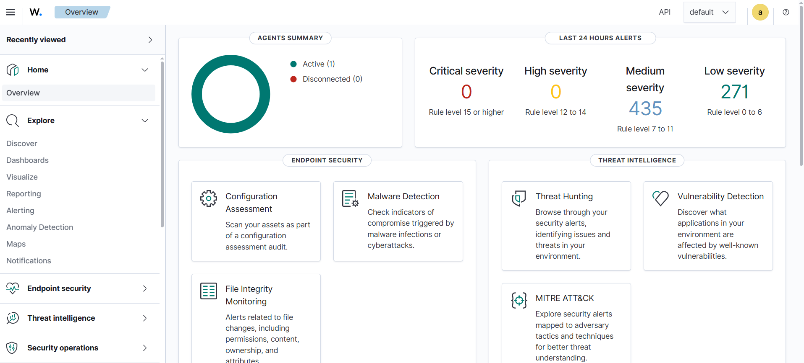
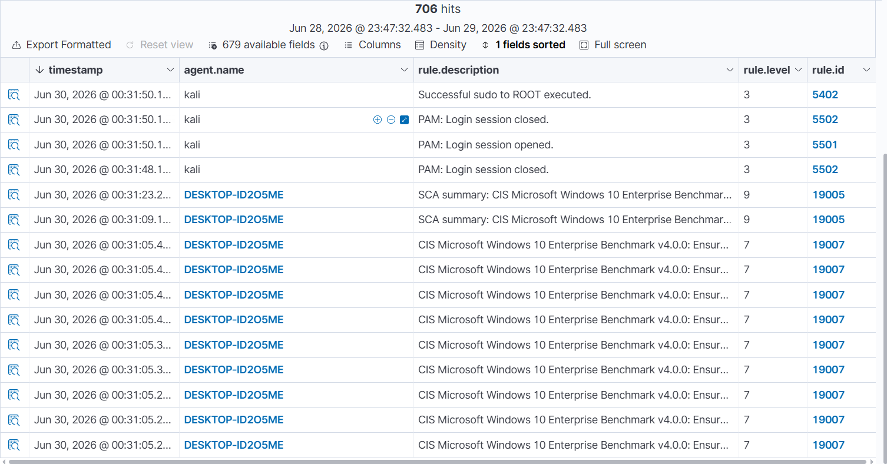
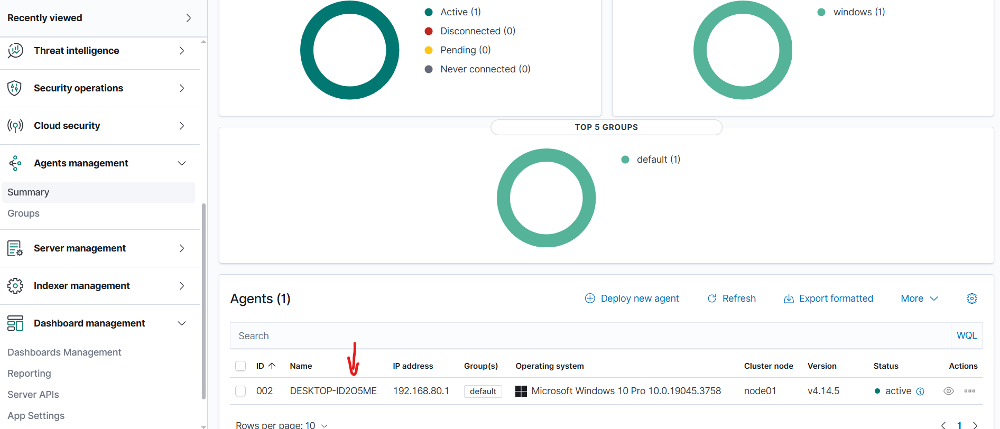
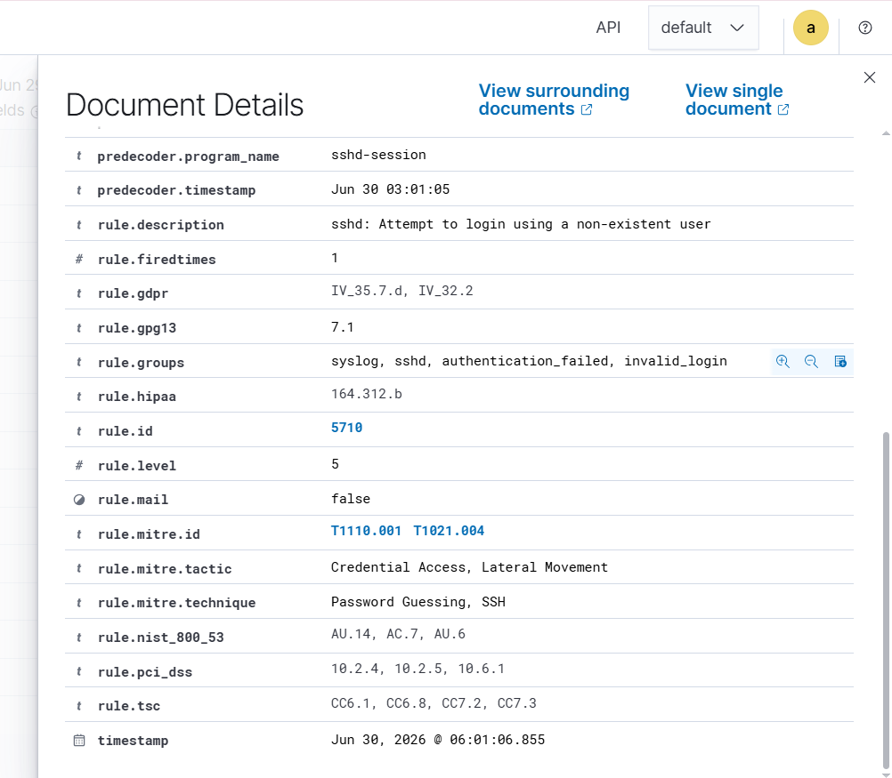
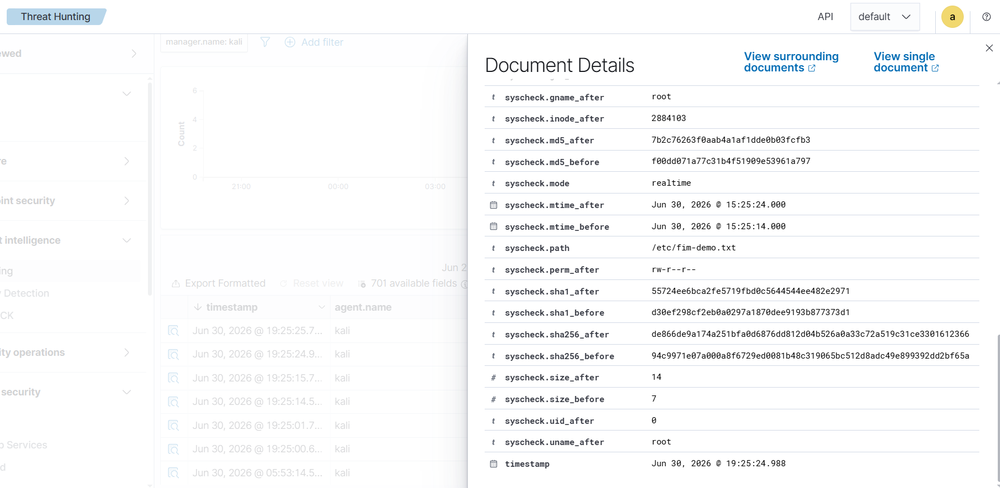

# 🛡️ <p align="center">
  
</p>

<h1 align="center">Wazuh SIEM Home Lab</h1>

<p align="center">
Enterprise SIEM • Threat Detection • Incident Response
</p>

<p align="center">
  
  
  
  
  
  
</p>

---

A complete **Security Information and Event Management (SIEM)** Home Lab built using **Wazuh**, **OpenSearch**, **Filebeat**, and **Wazuh Dashboard** on **Kali Linux** with a **Windows Agent** for endpoint monitoring.

---
# 📖 Table of Contents

- [Project Overview](#-project-overview)
- [Lab Architecture](#%EF%B8%8F-lab-architecture)
- [Technologies Used](#-technologies-used)
- [Project Structure](#-project-structure)
- [Images](#-images)
- [Features](#-features)
- [Documentation](#-documentation)
- [Future Improvements](#-future-improvements)

---
# 📖 Project Overview

This project demonstrates the deployment and configuration of a complete SIEM environment capable of:

- 🔍 Security Event Monitoring
- 📊 Log Collection & Analysis
- 🚨 Threat Detection
- 🛡️ File Integrity Monitoring (FIM)
- 📜 Custom Detection Rules
- 💻 Windows Endpoint Monitoring
- 🎯 MITRE ATT&CK Mapping

---

# 🏗️ Lab Architecture

> *(Architecture diagram will be added soon.)*

---

# 🚀 Technologies Used

| Technology | Purpose |
|------------|---------|
| Kali Linux | SIEM Server |
| Wazuh Manager | Security Monitoring |
| Wazuh Dashboard | Visualization |
| Wazuh Indexer (OpenSearch) | Data Storage |
| Filebeat | Log Shipping |
| Windows 10 | Endpoint |
| VMware Workstation | Virtualization |

---

# 📂 Project Structure

```text
Wazuh-SIEM-HomeLab/
├── configs/
├── detections/
├── docs/
├── reports/
├── screenshots/
├── scripts/
└── README.md
```

---

## 📊 Evidence & Project Visualizations

Here is the full dashboard breakdown and evidence from the security simulations implemented within the lab:

### 🏠 1. Dashboard Overview
Provides a centralized overview of the log evolution, metric counts, and continuous agent evaluation.
<p align="center">
  
</p>

---

### 🚨 2. Security Events Breakdown
Displays the live event stream parsed directly by the manager.
<p align="center">
  
</p>

---

### 🔍 3. Discover Alerts
Detailed exploration view of the generated alerts and logs within the indexer.
<p align="center">
  
</p>

---

### 💻 4. Monitored Agents
Shows the status of active endpoints continuously monitored by the Wazuh manager.
<p align="center">
  
</p>

---

### 🎯 5. MITRE ATT&CK Mapping
Central framework visualization showing the mapped techniques triggered during the simulations.
<p align="center">
  
</p>

---

### 🛡️ 6. SSH Brute Force Details
Detailed view of Rule ID `5710` triggered with mapped MITRE tactics and techniques.
<p align="center">
  
</p>

---

### 📂 7. File Integrity Monitoring (FIM) Alerts
Real-time capture of critical changes (Rule 550 & 554) detected on system files.
<p align="center">
  
</p>

## 🏠 1. Dashboard Overview

<p align="center">
  
</p>

---

## 📊 2. Security Events

<p align="center">
  
</p>

---

## 🔍 3. Discover Alerts

<p align="center">
  
</p>

---

## 💻 4. Monitored Agents

<p align="center">
  
</p>

---

## 🎯 5. MITRE ATT&CK Mapping

<p align="center">
  
</p>

# 📜 Detection Rules

The lab demonstrates effective detection and alerting capabilities for the following scenarios:

- **SSH Brute Force:** Detecting high-frequency failed login attempts over SSH.
- **Authentication Failures:** Tracking unauthorized access attempts across systems.
- **File Changes:** Generating alerts on modifications to sensitive system files.
- **Privilege Escalation:** Monitoring for unauthorized use of `sudo` or root access transitions.
- **Suspicious Login Attempts:** Identifying out-of-hours or anomalous user logons.
- **Root Activity:** Auditing critical commands executed by the superuser.

  # ⚔️ Attack Scenarios

## 🛡️ Scenario 1: SSH Authentication Monitoring & Brute Force Detection

### 🎯 Objective
Demonstrate Wazuh's capability to monitor SSH authentication events, capture real-time logs, and detect brute force or unauthorized login attempts.

### 💻 Lab Environment
| Component | Value |
|-----------|-------|
| **SIEM** | Wazuh 4.x |
| **Operating System** | Kali Linux (Manager & Endpoint) |
| **Dashboard** | OpenSearch-based Wazuh Dashboard |
| **Log Storage** | Wazuh Indexer |
| **Log Shipper** | Wazuh Agent / Journald |

🔍 Detection Results
After generating the authentication activity, the Wazuh Manager successfully collected, parsed, and indexed the events.

Observed Dashboard Statistics:

📊 Total Security Events: 1,365+

❌ Authentication Failures: 21+ (Captured continuous automated failed attempts)

🔓 Authentication Successes: 26+

🚨 High Severity Alerts (Level 12+): 5 Alerts triggered

🎯 Triggered Rule Breakdown:
Rule ID: 5710

Description: sshd: Attempt to login using a non-existent user

Alert Level: 5

🗺️ MITRE ATT&CK Mapping
Wazuh correlated the incoming syslog events directly with the MITRE ATT&CK framework:

Tactics: Credential Access, Lateral Movement

Techniques: * T1110.001 – Brute Force: Password Guessing

T1021.004 – Remote Services: SSH

T1078 – Valid Accounts

📊 Evidence & Artifacts
1. Threat Hunting Dashboard Overview
Shows the spike in security events and authentication statistics.

2. Detailed Rule Event & MITRE Mapping
Decoded payload showcasing the Rule ID 5710, trigger logic, and precise MITRE alignment.

🏆 Outcome
This scenario verifies that the deployed SIEM homelab successfully:

Monitors local and remote SSH endpoints continuously.

Ingeniously identifies patterns of brute force attacks (invalid users/rapid failures).

Visualizes critical metrics instantly for security analyst triage.

---


### ⚡ Attack Simulation
The SSH service was enabled and monitored locally. To generate high-fidelity alert spikes, an automated loop was executed to simulate an active **Brute Force / Password Guessing** attack:

```bash
# Verify SSH service status
sudo systemctl status ssh


 ### 🛡️ Scenario 1: SSH Brute Force Detection

To test the SIEM's real-time alerting and MITRE ATT&CK mapping, an SSH Brute Force attack was simulated locally using a fast automated loop generating failed authentication logs.

---

## 📂 Scenario 2: File Integrity Monitoring (FIM)

### 🎯 Objective
Verify Wazuh’s File Integrity Monitoring (FIM) capabilities in detecting unauthorized file additions and modifications within critical system directories in real-time.

### ⚡ Attack Simulation
The `/etc` directory contains vital configuration files. To simulate a persistence mechanism or unauthorized tampering, a new configuration file was created and modified using the root privileges:

```bash
# Simulating unauthorized file creation in a monitored directory
sudo touch /etc/fim-demo.txt

# Simulating unauthorized content modification
echo "Test" | sudo tee -a /etc/fim-demo.txt

## ⚔️ Scenario 3: SSH Brute Force Detection & Active Response Mitigation

### 🎯 Objective
Demonstrate Wazuh's capability to detect persistent multi-threaded authentication attacks (Brute Forcing) using automated tools and leverage **Active Response** to dynamically block the attacker's IP address.

### 🧰 Attack Tool
* **Hydra:** A fast and flexible network logon cracker used to simulate a high-velocity password guessing attack.

🛡️ Active Response Trigger:
Upon detecting a threshold of continuous failures, the Wazuh Manager dynamically invoked the firewall-drop script, modifying local host firewall rules (iptables) to block the adversarial IP source for 10 minutes.

🔍 Detection & Mitigation Metrics
| Property | Value |
|----------|-------|
| Rule ID | 5760 |
| Rule Level | 5 |
| Description | sshd: authentication failed |
| MITRE Technique | T1110.001 - Password Guessing |
| Remote Service | T1021.004 - SSH |

📊 Evidence & Artifacts
1. Advanced Brute Force Detection
Wazuh capturing the high-frequency failure signatures and successfully correlating them with the MITRE ATT&CK framework.

2. Active Response Execution Log
Evidence from the dashboard confirming that the security system shifted from passive monitoring to active containment by executing the firewall block.

🏆 Outcome
Real-time Alerting: Automated credential harvesting tools were immediately flagged.

Proactive Containment: The SIEM successfully transitioned into an active defense mechanism, neutralizing the attack path before a breach could occur.

Centralized Audit: Both the attack indicators and the automated defensive response were logged and indexed for forensic visibility.
---

### ⚡ Attack & Response Simulation
The attack was launched using Hydra against the local SSH service to trigger rapid, consecutive authentication failures:

```bash
# High-velocity SSH Brute Force simulation
hydra -l root -P /usr/share/wordlists/rockyou.txt ssh://localhost -t 4

#### ⚡ Attack Simulation Command:
```bash
for i in {1..50}; do ssh -o StrictHostKeyChecking=no -o PasswordAuthentication=yes -o PubkeyAuthentication=no -o PreferredAuthentications=password -o ConnectTimeout=1 -o NumberOfPasswordPrompts=1 non_existent_user@localhost -p 22 2>/dev/null; done

🔍 Wazuh Detection & Rule Details:
Wazuh successfully detected the anomalous spikes in authentication failures and triggered high-fidelity alerts based on the following pre-configured rules:

Triggered Rule: 5710 - sshd: Attempt to login using a non-existent user

Alert Level: 5 (Security Event Logged)

MITRE ATT&CK Mapping:

Tactics: Credential Access, Lateral Movement

Techniques: Password Guessing (T1110.001), SSH (T1021.004)


# ✨ Features

- **Centralized Log Collection:** Gathering logs from diverse endpoints into a single repository.
- **Security Event Monitoring:** Real-time tracking of system and security events.
- **File Integrity Monitoring (FIM):** Monitoring critical files for unauthorized modifications.
- **MITRE ATT&CK Mapping:** Aligning detected alerts with the MITRE ATT&CK framework.
- **OpenSearch Dashboard:** Powerful visualization and search capabilities for security analytics.
- **Agent Management:** Centralized control, deployment, and health tracking of endpoints.
- **Rule-Based Detection:** Utilizing built-in and custom rules to trigger high-fidelity alerts.
- **Alert Visualization:** Comprehensive charts and graphs for quick incident triage.

- 

# 📚 Documentation

The repository includes documentation for:

.Installation

.Configuration

.Detection Rules

.Reports

.Scripts

.Screenshots
---

# 🎯 Future Improvements

To expand this Home Lab into a fully-fledged SOC environment, the following integrations are planned:

- 💻 **Windows Agent Deployment:** Expanding monitoring to Windows endpoints.
- 🔍 **Sysmon Integration:** Deep endpoint logging for advanced threat hunting on Windows.
- 🦏 **Suricata IDS:** Network-based intrusion detection and traffic analysis.
- 🦅 **Zeek (Bro):** Network security monitoring and detailed protocol logging.
- 🦠 **VirusTotal Integration:** Automated file hash analysis against threat intelligence databases.
- 🐝 **TheHive:** Implementing an open-source incident response platform for case management.
- 🧠 **Cortex:** Automated observable analysis and active response orchestration.
- 🐋 **Docker Deployment:** Containerizing the entire SIEM stack for easier scalability.

---


# 👨‍💻 Author

**Mohamed ElKenany**

Cybersecurity | SOC Analyst | Blue Team

---

⭐ If you found this project useful, consider giving it a **Star** on GitHub.
