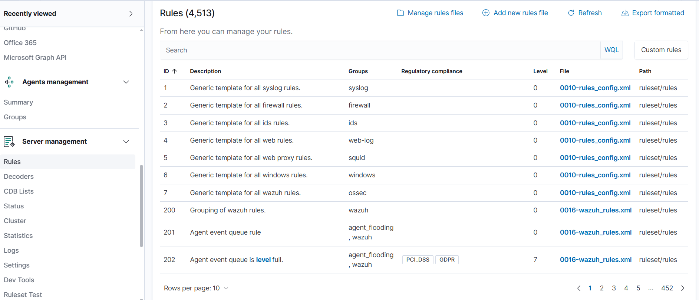

# 🛡️ <p align="center">
  
</p>

<h1 align="center">Wazuh SIEM Home Lab</h1>

<p align="center">
Enterprise SIEM • Threat Detection • Incident Response
</p>

<p align="center">
  
  
  
  
  
  
</p>

---

A complete **Security Information and Event Management (SIEM)** Home Lab built using **Wazuh**, **OpenSearch**, **Filebeat**, and **Wazuh Dashboard** on **Kali Linux** with a **Windows Agent** for endpoint monitoring.

---

# 📖 Project Overview

This project demonstrates the deployment and configuration of a complete SIEM environment capable of:

- 🔍 Security Event Monitoring
- 📊 Log Collection & Analysis
- 🚨 Threat Detection
- 🛡️ File Integrity Monitoring (FIM)
- 📜 Custom Detection Rules
- 💻 Windows Endpoint Monitoring
- 🎯 MITRE ATT&CK Mapping

---

# 🏗️ Lab Architecture

> *(Architecture diagram will be added soon.)*

---

# 🚀 Technologies Used

| Technology | Purpose |
|------------|---------|
| Kali Linux | SIEM Server |
| Wazuh Manager | Security Monitoring |
| Wazuh Dashboard | Visualization |
| Wazuh Indexer (OpenSearch) | Data Storage |
| Filebeat | Log Shipping |
| Windows 10 | Endpoint |
| VMware Workstation | Virtualization |

---

# 📂 Project Structure

```text
Wazuh-SIEM-HomeLab/
├── configs/
├── detections/
├── docs/
├── reports/
├── screenshots/
├── scripts/
└── README.md
```

---

# 📸 Screenshots

## 🏠 Dashboard


---

## 📊 Security Events


---

## 🔍 Discover


---

## 💻 Agents


---

## 🎯 MITRE ATT&CK


---

## 📜 Rules



---

# ✨ Features

- Centralized log collection
- Real-time security monitoring
- Windows endpoint monitoring
- Alert generation
- Rule-based detection
- MITRE ATT&CK integration
- File Integrity Monitoring
- Dashboard visualization

---

# 📚 Documentation

The repository includes documentation for:

- Installation
- Configuration
- Detection Rules
- Reports
- Scripts
- Screenshots

---

# 🎯 Future Improvements

- Add Active Response
- Add File Integrity Monitoring screenshots
- Add Security Configuration Assessment (SCA)
- Add Sigma Rules
- Add Custom Decoders
- Add Detection Engineering examples

---

# 👨‍💻 Author

**Mohamed ElKenany**

Cybersecurity | SOC Analyst | Blue Team

---

⭐ If you found this project useful, consider giving it a **Star** on GitHub.
