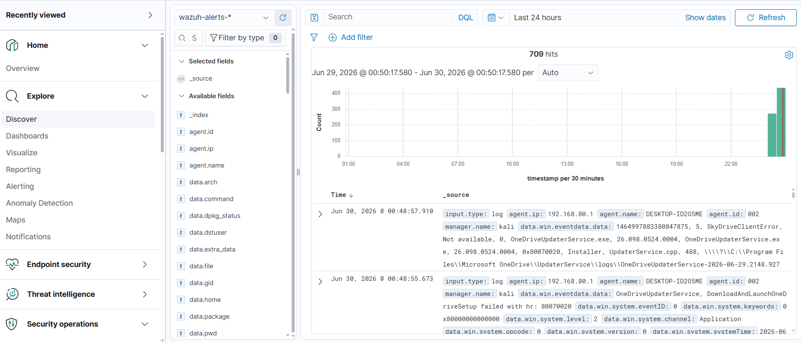
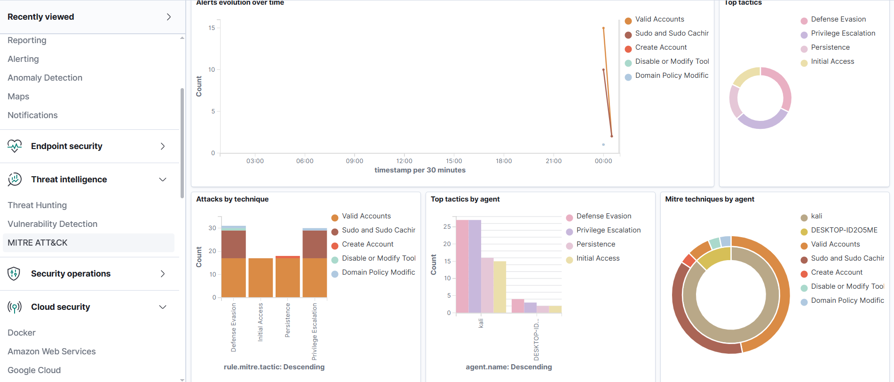

# 🛡️ <p align="center">
  
</p>

<h1 align="center">Wazuh SIEM Home Lab</h1>

<p align="center">
Enterprise SIEM • Threat Detection • Incident Response
</p>

<p align="center">
  
  
  
  
  
  
</p>

---

A complete **Security Information and Event Management (SIEM)** Home Lab built using **Wazuh**, **OpenSearch**, **Filebeat**, and **Wazuh Dashboard** on **Kali Linux** with a **Windows Agent** for endpoint monitoring.

---
# 📖 Table of Contents

- [Project Overview](#-project-overview)
- [Lab Architecture](#%EF%B8%8F-lab-architecture)
- [Technologies Used](#-technologies-used)
- [Project Structure](#-project-structure)
- [Images](#-images)
- [Features](#-features)
- [Documentation](#-documentation)
- [Future Improvements](#-future-improvements)

---
# 📖 Project Overview

This project demonstrates the deployment and configuration of a complete SIEM environment capable of:

- 🔍 Security Event Monitoring
- 📊 Log Collection & Analysis
- 🚨 Threat Detection
- 🛡️ File Integrity Monitoring (FIM)
- 📜 Custom Detection Rules
- 💻 Windows Endpoint Monitoring
- 🎯 MITRE ATT&CK Mapping

---

# 🏗️ Lab Architecture

> *(Architecture diagram will be added soon.)*

---

# 🚀 Technologies Used

| Technology | Purpose |
|------------|---------|
| Kali Linux | SIEM Server |
| Wazuh Manager | Security Monitoring |
| Wazuh Dashboard | Visualization |
| Wazuh Indexer (OpenSearch) | Data Storage |
| Filebeat | Log Shipping |
| Windows 10 | Endpoint |
| VMware Workstation | Virtualization |

---

# 📂 Project Structure

```text
Wazuh-SIEM-HomeLab/
├── configs/
├── detections/
├── docs/
├── reports/
├── screenshots/
├── scripts/
└── README.md
```

---

# 📸 Images

## 🏠 Dashboard


---

## 📊 Security Events


---

## 🔍 Discover



---

## 💻 Agents


---

## 🎯 MITRE ATT&CK



---

# 📜 Detection Rules

The lab demonstrates effective detection and alerting capabilities for the following scenarios:

- **SSH Brute Force:** Detecting high-frequency failed login attempts over SSH.
- **Authentication Failures:** Tracking unauthorized access attempts across systems.
- **File Changes:** Generating alerts on modifications to sensitive system files.
- **Privilege Escalation:** Monitoring for unauthorized use of `sudo` or root access transitions.
- **Suspicious Login Attempts:** Identifying out-of-hours or anomalous user logons.
- **Root Activity:** Auditing critical commands executed by the superuser.


- ### 🛡️ Scenario 1: SSH Brute Force Detection

To test the SIEM's real-time alerting and MITRE ATT&CK mapping, an SSH Brute Force attack was simulated locally using a fast automated loop generating failed authentication logs.

#### ⚡ Attack Simulation Command:
```bash
for i in {1..50}; do ssh -o StrictHostKeyChecking=no -o PasswordAuthentication=yes -o PubkeyAuthentication=no -o PreferredAuthentications=password -o ConnectTimeout=1 -o NumberOfPasswordPrompts=1 non_existent_user@localhost -p 22 2>/dev/null; done

🔍 Wazuh Detection & Rule Details:
Wazuh successfully detected the anomalous spikes in authentication failures and triggered high-fidelity alerts based on the following pre-configured rules:

Triggered Rule: 5710 - sshd: Attempt to login using a non-existent user

Alert Level: 5 (Security Event Logged)

MITRE ATT&CK Mapping:

Tactics: Credential Access, Lateral Movement

Techniques: Password Guessing (T1110.001), SSH (T1021.004)


# ✨ Features

- **Centralized Log Collection:** Gathering logs from diverse endpoints into a single repository.
- **Security Event Monitoring:** Real-time tracking of system and security events.
- **File Integrity Monitoring (FIM):** Monitoring critical files for unauthorized modifications.
- **MITRE ATT&CK Mapping:** Aligning detected alerts with the MITRE ATT&CK framework.
- **OpenSearch Dashboard:** Powerful visualization and search capabilities for security analytics.
- **Agent Management:** Centralized control, deployment, and health tracking of endpoints.
- **Rule-Based Detection:** Utilizing built-in and custom rules to trigger high-fidelity alerts.
- **Alert Visualization:** Comprehensive charts and graphs for quick incident triage.

- 

# 📚 Documentation

The repository includes documentation for:

.Installation

.Configuration

.Detection Rules

.Reports

.Scripts

.Screenshots
---

# 🎯 Future Improvements

To expand this Home Lab into a fully-fledged SOC environment, the following integrations are planned:

- 💻 **Windows Agent Deployment:** Expanding monitoring to Windows endpoints.
- 🔍 **Sysmon Integration:** Deep endpoint logging for advanced threat hunting on Windows.
- 🦏 **Suricata IDS:** Network-based intrusion detection and traffic analysis.
- 🦅 **Zeek (Bro):** Network security monitoring and detailed protocol logging.
- 🦠 **VirusTotal Integration:** Automated file hash analysis against threat intelligence databases.
- 🐝 **TheHive:** Implementing an open-source incident response platform for case management.
- 🧠 **Cortex:** Automated observable analysis and active response orchestration.
- 🐋 **Docker Deployment:** Containerizing the entire SIEM stack for easier scalability.

---


# 👨‍💻 Author

**Mohamed ElKenany**

Cybersecurity | SOC Analyst | Blue Team

---

⭐ If you found this project useful, consider giving it a **Star** on GitHub.
